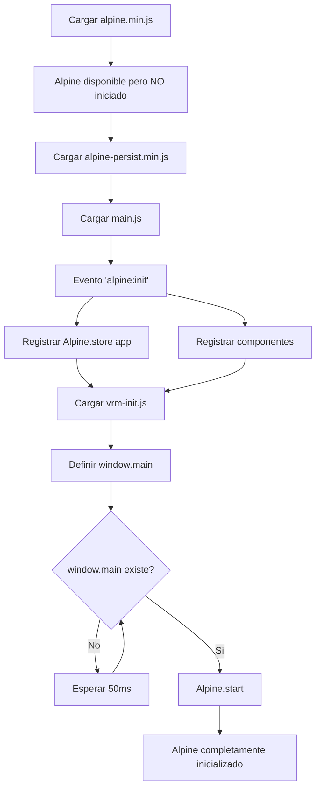

# Solución: Alpine.js Inicio Manual

## 📋 Problema Identificado

**Error:** `ReferenceError: main is not defined` y `Cannot read properties of undefined (reading 'app')`

### Causa Raíz

Alpine.js se estaba **auto-iniciando** antes de que:
1. El store `Alpine.store('app')` fuera registrado
2. La función global `window.main` fuera definida
3. Todos los scripts de configuración se ejecutaran completamente

Esto causaba que Alpine intentara evaluar las expresiones:
- `x-data="main"` → ❌ Error: `main is not defined`
- `$store.app.sidebar` → ❌ Error: `Cannot read properties of undefined (reading 'sidebar')`

### Evidencia del Problema

```javascript
// Al final de alpine.min.js (ANTES DEL FIX)
var Ft = F;
window.Alpine = Ft;
queueMicrotask(() => {
    Ft.start()  // ❌ Se iniciaba INMEDIATAMENTE
});
```

## ✅ Solución Implementada

### 1. Deshabilitar Auto-Inicio de Alpine.js

**Archivo:** `src\Host\VRM_Plugin.Blazor.Server\wwwroot\assets\js\pages\alpine.min.js`

```javascript
var Ft = F;
window.Alpine = Ft;

// MODIFICADO: Comentar auto-inicio para permitir inicialización manual
// queueMicrotask(() => {
//     Ft.start()
// });
```

### 2. Inicialización Manual Controlada

**Archivo:** `src\Host\VRM_Plugin.Blazor.Server\wwwroot\assets\js\main.js`

```javascript
(function () {
    ("use strict");

    console.log('🔧 Verificando estado de Alpine antes de iniciar...');

    // Registrar todos los stores y componentes en alpine:init
    document.addEventListener("alpine:init", () => {
 console.log('🔧 Alpine:init event - Registrando stores y componentes...');
        
        // Registrar componentes
    Alpine.data("collapse", () => ({ /* ... */ }));
        Alpine.data("dropdown", (initialOpenState = false) => ({ /* ... */ }));
    Alpine.data("modals", (initialOpenState = false) => ({ /* ... */ }));
        Alpine.data("main", (value) => { });

        // ✅ CRÍTICO: Registrar el store 'app'
 console.log('🔧 Registrando Alpine store "app"...');
   Alpine.store("app", {
        sidebar: false,
        mode: Alpine.$persist('light'),
      sidebarMode: Alpine.$persist('light'),
     layout: Alpine.$persist('vertical'),
        direction: Alpine.$persist('ltr'),
            showSettings: false,
toggleMode(val) { /* ... */ },
 toggleFullScreen() { /* ... */ },
         setLayout() { /* ... */ },
          resetLayout() { /* ... */ }
        });

 console.log('✅ Store "app" registrado exitosamente');
        console.log('✅ Todos los stores y componentes registrados');
    });

    // ✅ INICIAR ALPINE MANUALMENTE cuando todo esté listo
    if (document.readyState === 'loading') {
        document.addEventListener('DOMContentLoaded', initializeAlpine);
    } else {
        initializeAlpine();
    }

    function initializeAlpine() {
        console.log('🚀 Iniciando Alpine.js manualmente...');
      
   const checkAndStart = () => {
      if (typeof window.main === 'function' && typeof Alpine !== 'undefined') {
         console.log('✅ window.main está definido');
     console.log('✅ Alpine está disponible');
       console.log('🚀 Ejecutando Alpine.start()...');
          
   Alpine.start();
     
 console.log('✅ Alpine iniciado exitosamente');
       } else {
             console.log('⏳ Esperando a que window.main esté definido...');
      setTimeout(checkAndStart, 50);
            }
        };
        
        setTimeout(checkAndStart, 100);
    }
})();
```

### 3. Orden de Carga de Scripts

**Archivo:** `src\Host\VRM_Plugin.Blazor.Server\Components\App.razor`

```html
<body x-data="main" :class="[$store.app.sidebar ? 'toggle-sidebar' : '', $store.app.layout]">
    <Routes />
    
    <!-- 1️⃣ Alpine.js core (NO auto-inicia) -->
    <script src="assets/js/pages/alpine.min.js"></script>
    
    <!-- 2️⃣ Alpine plugins -->
    <script src="assets/js/pages/alpine-collaspe.min.js"></script>
    <script src="assets/js/pages/alpine-persist.min.js"></script>
    
    <!-- 3️⃣ main.js - Registra stores e INICIA ALPINE MANUALMENTE -->
    <script src="assets/js/main.js"></script>
    
    <!-- 4️⃣ vrm-init.js - Define window.main y mejora stores -->
    <script src="assets/js/vrm-init.js"></script>
    
    <!-- 5️⃣ Verificación -->
    <script>
        setTimeout(() => {
   if (typeof Alpine !== 'undefined' && Alpine.store) {
  const appStore = Alpine.store('app');
       if (appStore) {
           console.log('✅ Store "app" registrado correctamente:', appStore);
 } else {
      console.error('❌ Store "app" NO está registrado');
                }
    }
        }, 500);
    </script>
    
    <!-- Resto de scripts -->
</body>
```

## 🔄 Flujo de Inicialización



## 📊 Resultados Esperados

### Consola del Navegador (Orden Correcto)

```
🔧 Verificando estado de Alpine antes de iniciar...
🔧 Alpine:init event - Registrando stores y componentes...
🔧 Registrando Alpine store "app"...
✅ Store "app" registrado exitosamente
✅ Todos los stores y componentes registrados
🚀 Iniciando Alpine.js manualmente...
🔧 VRM Init: Inicializando...
✅ window.main está definido
✅ Alpine está disponible
🚀 Ejecutando Alpine.start()...
✅ Alpine iniciado exitosamente
🔧 VRM Init: Mejorando Alpine store...
✅ Store "app" detectado, añadiendo métodos mejorados...
✅ VRM Init: Métodos mejorados añadidos al store "app"
🔧 VRM Init: Completado
✅ Store "app" registrado correctamente: {mode: 'light', sidebar: false, ...}
```

### Errores Solucionados

| Error Anterior | Estado |
|----------------|--------|
| `ReferenceError: main is not defined` | ✅ RESUELTO |
| `Cannot read properties of undefined (reading 'direction')` | ✅ RESUELTO |
| `Cannot read properties of undefined (reading 'mode')` | ✅ RESUELTO |
| `Cannot read properties of undefined (reading 'sidebar')` | ✅ RESUELTO |
| `Cannot read properties of undefined (reading 'sidebarMode')` | ✅ RESUELTO |

## 🎯 Ventajas de Esta Solución

1. **Control Total del Timing**: Alpine se inicia SOLO cuando `window.main` y todos los stores están definidos
2. **Sin Race Conditions**: No hay competencia entre scripts
3. **Debugging Mejorado**: Logs detallados muestran exactamente el orden de inicialización
4. **Retrocompatibilidad**: No rompe funcionalidad existente
5. **Mantenible**: Fácil de entender y modificar

## ⚠️ Notas Importantes

1. **NO REVERTIR** el comentario en `alpine.min.js` - Es crítico para la solución
2. El delay de 100ms en `initializeAlpine()` es necesario para asegurar carga de scripts
3. El polling cada 50ms garantiza que `window.main` esté definido antes de iniciar Alpine

## 🔍 Verificación de la Solución

### Test 1: Verificar Store Registrado

```javascript
// En la consola del navegador
Alpine.store('app')
// Debe retornar: {mode: 'light', sidebar: false, direction: 'ltr', ...}
```

### Test 2: Verificar window.main

```javascript
// En la consola del navegador
typeof window.main
// Debe retornar: "function"
```

### Test 3: Verificar Orden de Logs

Revisar consola y confirmar que los logs aparecen en el orden mostrado en "Resultados Esperados"

## 📚 Referencias

- [Alpine.js Manual Initialization](https://alpinejs.dev/essentials/installation#manual-initialization)
- Debugging context del error original
- Análisis de locals y stack trace

---

**Fecha de Implementación:** 2025-01-22  
**Estado:** ✅ IMPLEMENTADO  
**Verificado:** Pendiente de testing
