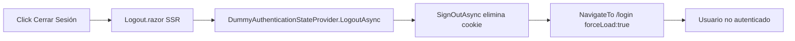

# ?? Autenticación y Cookies - Estado Actual

**Versión:** 2.0  
**Estado:** ? Implementado y Funcionando  
**Última actualización:** Enero 2025

---

## ?? Resumen Ejecutivo

El sistema VRM Plugin Demo utiliza:
- **Autenticación simulada** (DummyAuthenticationStateProvider) con usuarios hardcoded
- **Cookies HTTP persistentes** vía ASP.NET Core Cookie Authentication
- **Renderizado condicional** (SSR para Login/Logout, Interactive Server para páginas protegidas)
- **PersistentComponentState** para transferir autenticación entre modos de renderizado

---

## ?? Cómo Funcionan las Cookies

### Configuración (Program.cs)

```csharp
builder.Services.AddAuthentication(CookieAuthenticationDefaults.AuthenticationScheme)
    .AddCookie(options =>
    {
        options.Cookie.Name = ".AspNetCore.Cookies";
        options.Cookie.HttpOnly = true;  // ?? No accesible desde JavaScript
  options.Cookie.SecurePolicy = CookieSecurePolicy.SameAsRequest;
    options.Cookie.SameSite = SameSiteMode.Strict;  // ??? Protección CSRF
        options.ExpireTimeSpan = TimeSpan.FromHours(8);
        options.SlidingExpiration = true;  // ?? Renovación automática
      options.LoginPath = "/login";
        options.LogoutPath = "/logout";
    });
```

### Flujo de Login

```mermaid
graph LR
    A[Usuario en /login] --> B[Login.razor SSR]
    B --> C[DummyAuthenticationStateProvider.LoginAsync]
    C --> D[SignInAsync escribe cookie]
    D --> E[NavigateTo /index forceLoad:true]
  E --> F[Nueva petición HTTP]
    F --> G[Index.razor SSR prerender]
    G --> H[HttpContext lee cookie]
    H --> I[OnPersistingAsync serializa UserInfo]
    I --> J[Circuit Interactive inicia]
    J --> K[TryTakeFromJson recupera UserInfo]
    K --> L[Usuario autenticado]
```



### Flujo de Logout



---

## ?? Renderizado Condicional

### Por qué SSR para Login/Logout

**Login y Logout usan SSR estático** porque necesitan:
- Acceso a `HttpContext` para escribir/eliminar cookies HTTP
- Response.Headers modificable (no ha comenzado la respuesta)

**Páginas protegidas usan Interactive Server** porque necesitan:
- Interactividad completa (SignalR)
- Componentes dinámicos
- Módulos cargados dinámicamente

### Implementación (Routes.razor)

```razor
@{
    var isAuthPage = routeData.PageType == typeof(Login) ||
       routeData.PageType == typeof(Logout);
}

@if (isAuthPage)
{
 @* SSR puro - puede escribir cookies *@
    <RouteView RouteData="@routeData" />
}
else
{
    @* Interactive Server - usa estado persistido *@
 <AuthorizeRouteView RouteData="@routeData" DefaultLayout="@typeof(MainLayout)">
    <NotAuthorized>
            <RedirectToLogin />
</NotAuthorized>
    </AuthorizeRouteView>
}
```

---

## ?? Usuarios de Prueba

| Email | Nombre | Roles |
|-------|--------|-------|
| admin@vrm.com | Administrador VRM | Admin |
| gerente.finanzas@vrm.com | Carlos Gerente Finanzas | GerenteFinanzas |
| coordinador.finanzas@vrm.com | Ana Coordinadora | CoordinadorFinanzas |
| contador@vrm.com | Luis Contador | Contador |
| gestor.prospectos@vrm.com | María Gestora | GestorProspectos |

**Contraseña:** Cualquier valor (la validación es dummy)

---

## ?? Seguridad Actual

### ? Implementado

- ? Cookies HttpOnly (no accesibles desde JavaScript)
- ? SameSite=Strict (protección CSRF)
- ? Sliding expiration (renovación automática)
- ? Secure en producción (solo HTTPS)
- ? Validación de Response.HasStarted antes de escribir cookies

### ?? Limitaciones (Sistema Dummy)

- ?? Contraseñas no hasheadas (usuarios hardcoded)
- ?? Sin rate limiting en login
- ?? Sin lockout después de intentos fallidos
- ?? Sin two-factor authentication
- ?? Sin recuperación de contraseña

### ?? Próximos Pasos (v2.1)

Para producción, se migrará a:
- **ASP.NET Core Identity** (gestión completa de usuarios)
- **Entity Framework Core** (usuarios en base de datos)
- **Password hashing** (bcrypt/Argon2)
- **2FA** (TOTP)
- **Rate limiting** en endpoints de autenticación

---

## ?? Cómo Probar

### Test 1: Login y Persistencia
```
1. Ir a https://localhost:XXXX/login
2. Login como admin@vrm.com
3. Recargar navegador (F5)
? Esperado: Usuario sigue autenticado
```

### Test 2: Multi-Tab
```
1. Login en Tab 1
2. Abrir nueva Tab 2 con misma URL
? Esperado: Tab 2 ya está autenticada (misma cookie)
```

### Test 3: Logout
```
1. Login como cualquier usuario
2. Click "Cerrar Sesión"
3. Recargar navegador
? Esperado: Redirige a /login (cookie eliminada)
```

### Test 4: Permisos
```
1. Login como gerente.finanzas@vrm.com
2. Ir a /finanzas
? Esperado: Ve botón "Timbrar SAT"

3. Login como contador@vrm.com
4. Ir a /finanzas
? Esperado: NO ve botón "Timbrar SAT"
```

---

## ?? Documentación Relacionada

- **Arquitectura de renderizado:** [SOLUCION_FINAL_RENDERIZADO_CONDICIONAL.md](SOLUCION_FINAL_RENDERIZADO_CONDICIONAL.md)
- **Sistema de permisos:** [GUIA_SISTEMA_PERMISOS_GRANULARES.md](GUIA_SISTEMA_PERMISOS_GRANULARES.md)
- **Historial de versiones:** [VERSION_HISTORY.md](VERSION_HISTORY.md)

---

## ? FAQ

### ¿Por qué no usar solo Interactive Server?
**R:** Interactive Server ya ha iniciado la respuesta HTTP (Circuit), por lo que no puede modificar headers/cookies. Login/Logout necesitan SSR para acceso a HttpContext.

### ¿Las cookies son seguras?
**R:** Sí, con las configuraciones actuales:
- `HttpOnly=true` ? No accesibles desde JavaScript
- `Secure=true` (producción) ? Solo HTTPS
- `SameSite=Strict` ? Protección CSRF

### ¿Cuánto dura la sesión?
**R:** 8 horas por defecto, con renovación automática (sliding expiration). Configurable en `Program.cs`.

### ¿Cómo cambio usuarios de prueba?
**R:** Editar `DummyAuthenticationStateProvider.cs` ? propiedad `DummyUsers`. Ver [GUIA_AUTENTICACION_SIMULADA.md](GUIA_AUTENTICACION_SIMULADA.md).

### ¿Cuándo migrar a Identity?
**R:** Cuando necesites:
- Hash de contraseñas
- Usuarios en base de datos
- Recuperación de contraseña
- 2FA
- Lockout de cuentas

---

## ?? Archivos Clave

| Archivo | Propósito |
|---------|-----------|
| `Program.cs` | Configuración de cookies y autenticación |
| `DummyAuthenticationStateProvider.cs` | Lógica de login/logout + manejo de cookies |
| `Login.razor` | Página de login (SSR) |
| `Logout.razor` | Página de logout (SSR) |
| `Routes.razor` | Renderizado condicional SSR/Interactive |
| `App.razor` | Componente raíz con PersistentComponentState |

---

## ?? Estado del Sistema

| Característica | Estado |
|----------------|--------|
| Cookies persistentes | ? Implementado |
| Renderizado condicional | ? Implementado |
| Login/Logout funcionando | ? Sí |
| Permisos granulares | ? Sí |
| Multi-tab sync | ? Sí |
| Sesión persistente (F5) | ? Sí |
| Producción-ready | ?? Requiere migración a Identity |

---

**?? Última actualización:** Enero 2025  
**?? Mantenedor:** Equipo VRM  
**?? Versión:** 2.0
