# ?? Diagramas del Sistema de Acciones Dinámicas

Este documento complementa [SISTEMA_DE_ACCIONES_DINAMICAS.md](./SISTEMA_DE_ACCIONES_DINAMICAS.md) con diagramas visuales detallados.

---

## ?? Diagrama 1: Flujo Completo de Carga

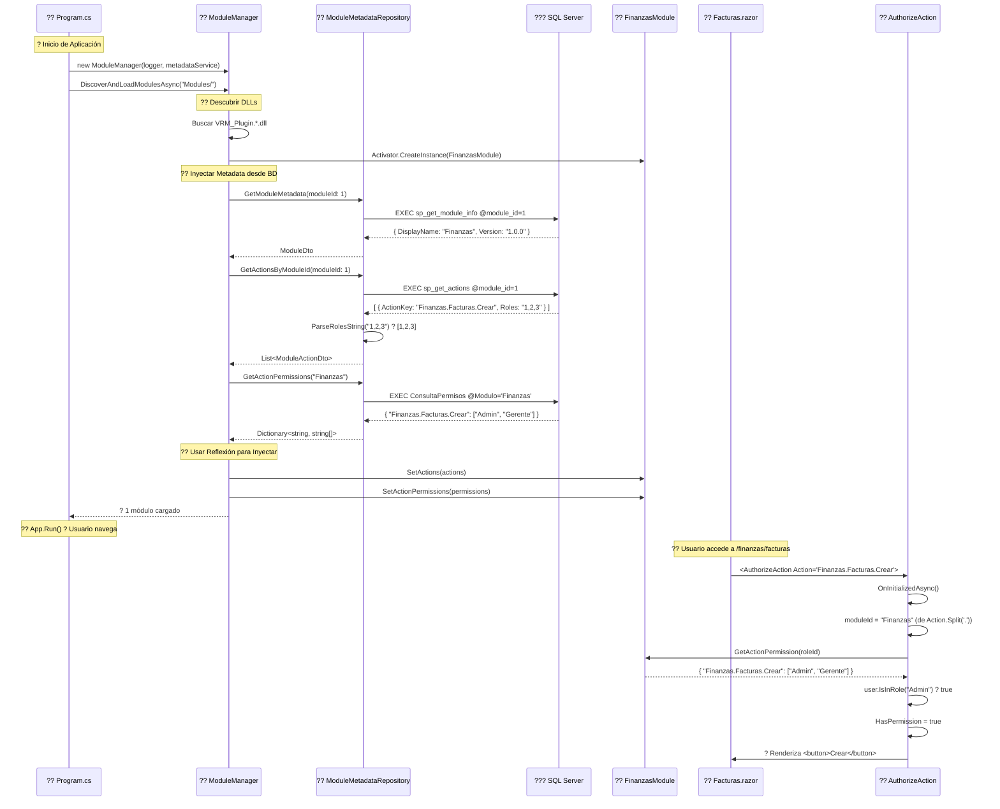

---

## ??? Diagrama 2: Arquitectura de Capas

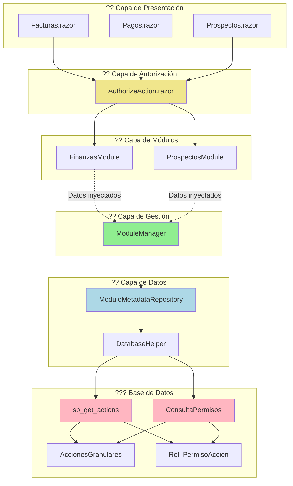

---

## ?? Diagrama 3: Ciclo de Vida de una Acción

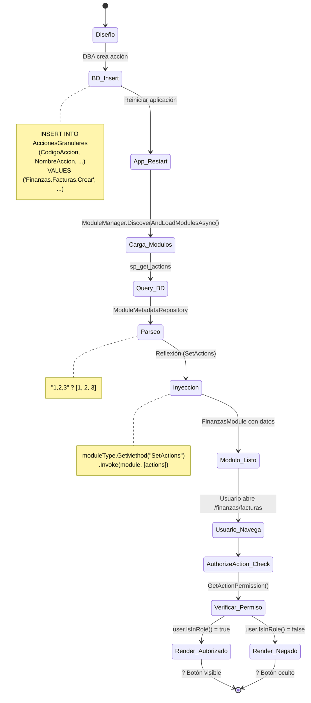

---

## ?? Diagrama 4: Estructura de Datos

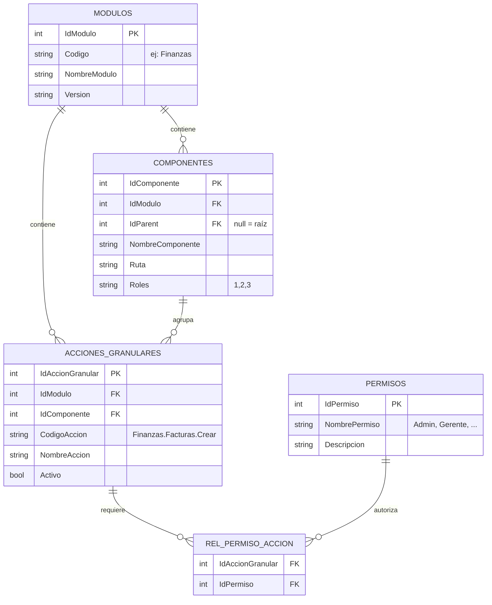

---

## ?? Diagrama 5: Flujo de Autorización en Runtime

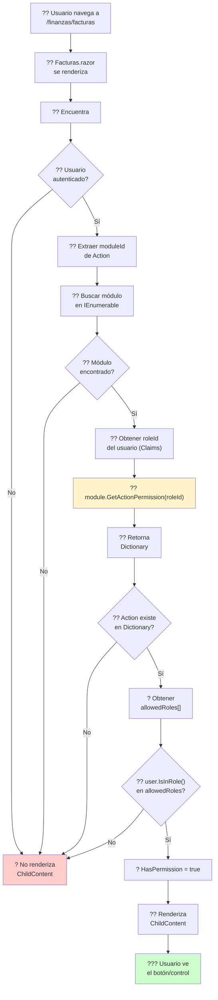

---

## ?? Diagrama 6: Inyección de Dependencias

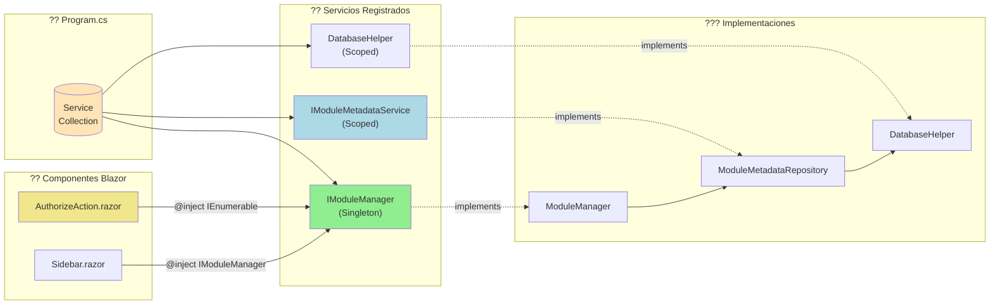

---

## ?? Diagrama 7: Comparación Antes vs Después

```mermaid
flowchart TB
    subgraph "? ANTES: Permisos Hardcodeados"
        A1["?? FinanzasModule.cs<br/>GetActionPermissions()"]
        A2["?? Diccionario estático<br/>en código"]
        A3["?? Cambio requiere<br/>recompilar"]
        A4["?? Desplegar DLL<br/>nueva"]
        
        A1 --> A2 --> A3 --> A4
    end
    
    subgraph "? DESPUÉS: Permisos Dinámicos"
        B1["??? SQL Server<br/>AccionesGranulares"]
        B2["?? sp_get_actions<br/>Stored Procedure"]
        B3["?? ModuleMetadataRepository<br/>Parsea datos"]
        B4["?? ModuleManager<br/>Inyecta con reflexión"]
        B5["?? FinanzasModule<br/>_actionPermissions"]
        B6["?? AuthorizeAction<br/>Consulta en runtime"]
        
        B1 --> B2 --> B3 --> B4 --> B5 --> B6
    end
    
    style A1 fill:#ffcccc
    style A2 fill:#ffcccc
    style A3 fill:#ffcccc
    style A4 fill:#ffcccc
    
    style B1 fill:#ccffcc
    style B2 fill:#ccffcc
    style B3 fill:#ccffcc
    style B4 fill:#ccffcc
    style B5 fill:#ccffcc
    style B6 fill:#ccffcc
```

---

## ?? Diagrama 8: Matriz de Permisos (Ejemplo)

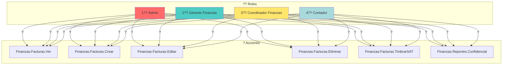

---

## ?? Diagrama 9: Performance y Caché

```mermaid
flowchart TD
    A["? App Startup<br/>t=0ms"] --> B["?? Discover Modules<br/>t=50ms"]
    
    B --> C["??? Query BD<br/>sp_get_actions<br/>t=100ms"]
    
    C --> D["?? Parse DTOs<br/>t=120ms"]
    
    D --> E["?? Inject to Modules<br/>Reflexión<br/>t=150ms"]
    
    E --> F["? Modules Ready<br/>t=200ms"]
    
    F --> G["?? App Running"]
    
    G --> H["?? User Request 1<br/>/finanzas/facturas"]
    
    H --> I["?? AuthorizeAction<br/>Check Permissions"]
    
    I --> J["?? module.GetActionPermission()<br/>? CACHÉ en memoria"]
    
    J --> K["? Render<br/>~1ms (sin query BD)"]
    
    K --> L["?? User Request 2<br/>/finanzas/pagos"]
    
    L --> M["?? AuthorizeAction<br/>Check Permissions"]
    
    M --> N["?? Mismo módulo<br/>? CACHÉ reutilizada"]
    
    N --> O["? Render<br/>~1ms"]
    
    style J fill:#90EE90
    style N fill:#90EE90
    
    note right of J
        ? Sin queries a BD
        ? Datos en RAM
        ? Ultra rápido
    end note
```

---

## ??? Diagrama 10: Troubleshooting Decision Tree

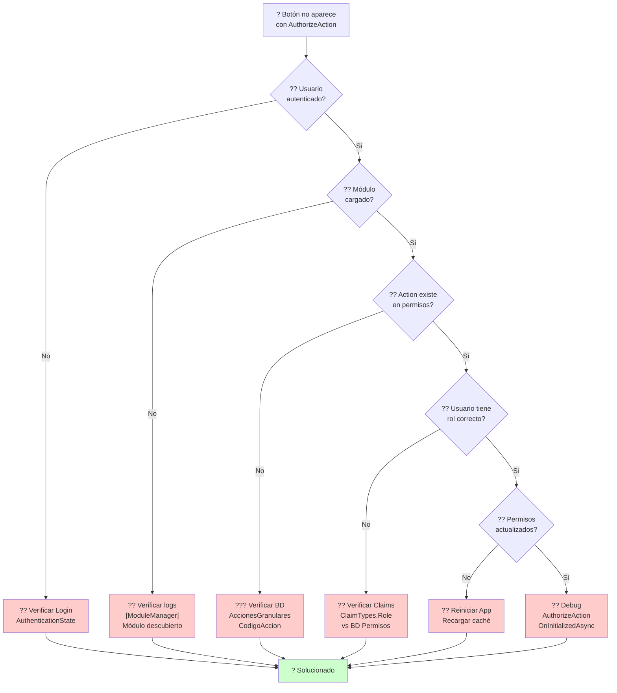

---

## ?? Diagrama 11: Escalabilidad

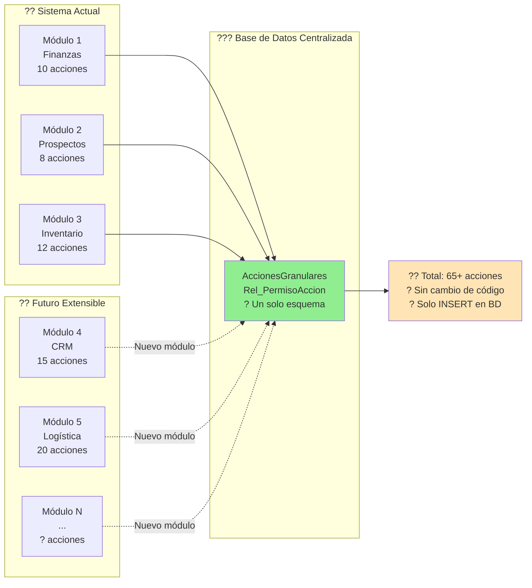

---

## ?? Conclusión Visual

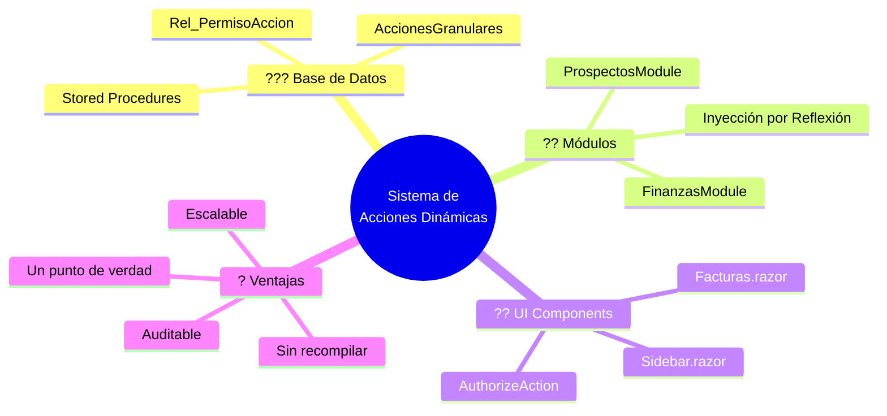

---

**?? Documentos Relacionados:**
- [SISTEMA_DE_ACCIONES_DINAMICAS.md](./SISTEMA_DE_ACCIONES_DINAMICAS.md) - Guía completa con código
- [README.md](../README.md) - Documentación principal del proyecto

---

**?? Herramientas para visualizar diagramas:**
- [Mermaid Live Editor](https://mermaid.live)
- GitHub (renderiza automáticamente)
- VS Code con extensión "Markdown Preview Mermaid Support"
