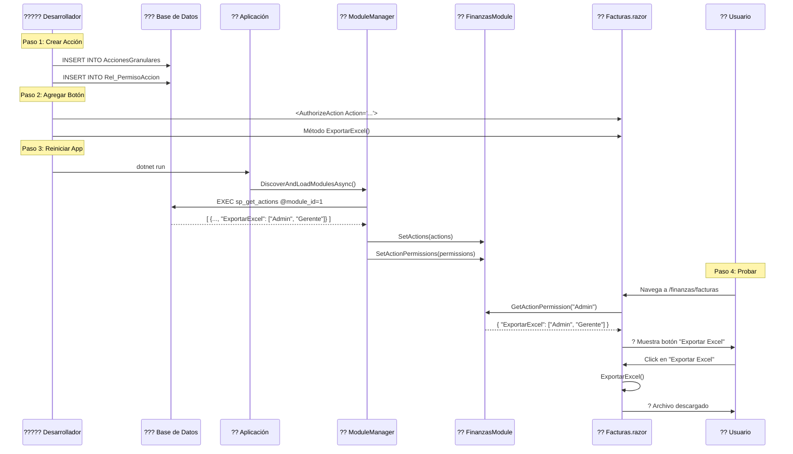

# ?? Ejemplo Completo: Agregar Nueva Acción "Exportar a Excel"

> **Tutorial paso a paso para agregar una nueva acción desde cero hasta su uso en componente**

---

## ?? Escenario

Queremos agregar una nueva funcionalidad: **"Exportar Facturas a Excel"**

**Requisitos:**
- Solo usuarios con rol **Admin** o **Gerente Finanzas** pueden exportar
- Debe aparecer un botón en la página de facturas
- No queremos modificar el código del módulo

---

## ?? Paso 1: Crear Acción en Base de Datos

### 1.1 Insertar la Acción

```sql
-- Conectarse a la base de datos VRM_PluginDemo
USE VRM_PluginDemo;
GO

-- Insertar nueva acción
INSERT INTO AccionesGranulares (
    IdModulo,           -- 1 = Finanzas
    IdComponente,       -- 2 = Facturas
    CodigoAccion,       -- Formato: Modulo.Componente.Accion
    NombreAccion,       -- Nombre descriptivo
    DescripcionAccion,  -- Descripción detallada
    Activo              -- 1 = Activa
)
VALUES (
    1,                                      -- Módulo Finanzas
    2,                                      -- Componente Facturas
    'Finanzas.Facturas.ExportarExcel',    -- Código de acción
    'Exportar a Excel',                    -- Nombre
    'Permite exportar el listado de facturas a un archivo Excel (.xlsx)', -- Descripción
    1                                       -- Activa
);

-- Obtener el ID de la acción recién creada
DECLARE @IdAccion INT = SCOPE_IDENTITY();

-- Mostrar ID para verificar
SELECT @IdAccion AS 'ID de Acción Creada';
```

**Resultado esperado:**
```
ID de Acción Creada
-------------------
15
```

---

### 1.2 Asignar Permisos

```sql
-- Asignar permiso a Admin (ID: 1)
INSERT INTO Rel_PermisoAccion (IdAccionGranular, IdPermiso)
VALUES (@IdAccion, 1);

-- Asignar permiso a Gerente Finanzas (ID: 2)
INSERT INTO Rel_PermisoAccion (IdAccionGranular, IdPermiso)
VALUES (@IdAccion, 2);

-- Verificar permisos asignados
SELECT 
    ag.CodigoAccion,
    p.IdPermiso,
    p.NombrePermiso
FROM AccionesGranulares ag
INNER JOIN Rel_PermisoAccion rp ON ag.IdAccionGranular = rp.IdAccionGranular
INNER JOIN Permisos p ON rp.IdPermiso = p.IdPermiso
WHERE ag.IdAccionGranular = @IdAccion;
```

**Resultado esperado:**
```
CodigoAccion                     | IdPermiso | NombrePermiso
---------------------------------|-----------|------------------
Finanzas.Facturas.ExportarExcel  | 1         | Admin
Finanzas.Facturas.ExportarExcel  | 2         | GerenteFinanzas
```

---

## ?? Paso 2: Agregar Botón en Componente Razor

### 2.1 Abrir el archivo Facturas.razor

?? **Ruta:** `src/Modules/Finanzas/VRM_PluginDemo.Modules.Finanzas/Components/Facturas.razor`

### 2.2 Agregar botón de exportación

Buscar la sección de filtros (línea ~44) y agregar después del botón "Nueva Factura":

```razor
<!-- ANTES: Solo botón Nueva Factura -->
<div class="col-md-3 text-end">
    <AuthorizeAction Action="Finanzas.Facturas.Crear">
        <button class="btn btn-primary" @onclick="AbrirModalCrear">
            <i class="ri-add-line mr-1"></i>
            Nueva Factura
        </button>
    </AuthorizeAction>
</div>

<!-- DESPUÉS: Botones Nueva Factura + Exportar Excel -->
<div class="col-md-3 text-end">
    <!-- Botón existente -->
    <AuthorizeAction Action="Finanzas.Facturas.Crear">
        <button class="btn btn-primary" @onclick="AbrirModalCrear">
            <i class="ri-add-line mr-1"></i>
            Nueva Factura
        </button>
    </AuthorizeAction>
    
    <!-- ? NUEVO: Botón Exportar Excel -->
    <AuthorizeAction Action="Finanzas.Facturas.ExportarExcel">
        <button class="btn btn-success ms-2" @onclick="ExportarExcel">
            <i class="ri-file-excel-line mr-1"></i>
            Exportar a Excel
        </button>
    </AuthorizeAction>
</div>
```

### 2.3 Agregar método de exportación

En la sección `@code { }` (línea ~250), agregar el método:

```razor
@code {
    // ... código existente ...
    
    // ==================== EXPORTACIÓN ====================
    
    /// <summary>
    /// ? NUEVO: Exporta facturas filtradas a Excel
    /// </summary>
    private async Task ExportarExcel()
    {
        try
        {
            // Simular exportación (implementar con biblioteca como EPPlus o ClosedXML)
            await Task.Delay(1000); // Simulación de proceso
            
            // TODO: Implementar exportación real
            // using var package = new ExcelPackage();
            // var worksheet = package.Workbook.Worksheets.Add("Facturas");
            // ... escribir datos ...
            
            Console.WriteLine($"Exportando {_facturasFiltradas.Count} facturas a Excel...");
            
            // Por ahora, mostrar mensaje de éxito
            // (En producción, generar archivo y descargarlo)
            StateHasChanged();
        }
        catch (Exception ex)
        {
            Console.WriteLine($"Error al exportar: {ex.Message}");
        }
    }
}
```

---

## ?? Paso 3: Reiniciar Aplicación

### 3.1 Detener la aplicación (si está corriendo)
```bash
# Presionar Ctrl+C en la terminal
```

### 3.2 Iniciar nuevamente
```bash
cd src/Host/VRM_PluginDemo.Blazor.Server
dotnet run
```

### 3.3 Verificar logs

Buscar en los logs:
```
[ModuleManager] 11 acciones inyectadas para Finanzas  # ? Era 10, ahora 11
```

---

## ? Paso 4: Probar la Funcionalidad

### 4.1 Login como Admin

1. Navegar a `https://localhost:5001/login`
2. Usuario: `admin@vrm.com`
3. Password: `cualquiera` (acepta cualquier password)
4. Click en **Iniciar Sesión**

### 4.2 Ir a Facturas

1. Navegar a `/finanzas/facturas`
2. Verificar que aparece el botón **"Exportar a Excel"** ?

### 4.3 Probar Permisos

**Caso 1: Admin (debería ver botón)**
```
Usuario: admin@vrm.com
Resultado: ? Botón "Exportar a Excel" VISIBLE
```

**Caso 2: Gerente Finanzas (debería ver botón)**
```
Usuario: gerente.finanzas@vrm.com
Resultado: ? Botón "Exportar a Excel" VISIBLE
```

**Caso 3: Contador (NO debería ver botón)**
```
Usuario: contador@vrm.com
Resultado: ? Botón "Exportar a Excel" OCULTO
```

---

## ?? Paso 5: Verificar en Base de Datos

### 5.1 Consultar acciones del módulo Finanzas

```sql
SELECT 
    ag.IdAccionGranular,
    ag.CodigoAccion,
    ag.NombreAccion,
    ag.DescripcionAccion,
    STRING_AGG(p.NombrePermiso, ', ') AS RolesPermitidos
FROM AccionesGranulares ag
LEFT JOIN Rel_PermisoAccion rp ON ag.IdAccionGranular = rp.IdAccionGranular
LEFT JOIN Permisos p ON rp.IdPermiso = p.IdPermiso
WHERE ag.IdModulo = 1  -- Finanzas
GROUP BY 
    ag.IdAccionGranular, 
    ag.CodigoAccion, 
    ag.NombreAccion, 
    ag.DescripcionAccion
ORDER BY ag.CodigoAccion;
```

**Resultado esperado:**
```
IdAccionGranular | CodigoAccion                     | NombreAccion           | RolesPermitidos
-----------------|----------------------------------|------------------------|----------------------------
2                | Finanzas.Facturas.Crear          | Crear Factura          | Admin, GerenteFinanzas, CoordinadorFinanzas
3                | Finanzas.Facturas.Editar         | Editar Factura         | Admin, GerenteFinanzas, CoordinadorFinanzas
4                | Finanzas.Facturas.Eliminar       | Eliminar Factura       | Admin, GerenteFinanzas
15               | Finanzas.Facturas.ExportarExcel  | Exportar a Excel       | Admin, GerenteFinanzas
...
```

---

## ?? Lo Que Acabas de Hacer

### ? Sin modificar código del módulo
- NO editaste `FinanzasModule.cs`
- NO recompilaste la DLL del módulo

### ? Solo 2 archivos tocados
1. **Base de datos** (SQL)
2. **Facturas.razor** (UI)

### ? Beneficios obtenidos
- ? Permisos centralizados en BD
- ? Auditable (cambios en BD tienen log)
- ? Escalable (agregar más roles sin código)
- ? Mantenible (cambiar permisos sin recompilar)

---

## ?? Paso 6 (Opcional): Implementar Exportación Real

### 6.1 Agregar paquete NuGet

```bash
cd src/Modules/Finanzas/VRM_PluginDemo.Modules.Finanzas
dotnet add package EPPlus --version 7.0.0
```

### 6.2 Implementar exportación con EPPlus

```razor
@using OfficeOpenXml

@code {
    private async Task ExportarExcel()
    {
        try
        {
            // Configurar EPPlus (aceptar licencia non-commercial)
            ExcelPackage.LicenseContext = LicenseContext.NonCommercial;
            
            using var package = new ExcelPackage();
            var worksheet = package.Workbook.Worksheets.Add("Facturas");
            
            // Encabezados
            worksheet.Cells[1, 1].Value = "Número";
            worksheet.Cells[1, 2].Value = "Cliente";
            worksheet.Cells[1, 3].Value = "RFC";
            worksheet.Cells[1, 4].Value = "Fecha Emisión";
            worksheet.Cells[1, 5].Value = "Total";
            worksheet.Cells[1, 6].Value = "Estado";
            
            // Datos
            int row = 2;
            foreach (var factura in _facturasFiltradas)
            {
                worksheet.Cells[row, 1].Value = factura.Numero;
                worksheet.Cells[row, 2].Value = factura.NombreCliente;
                worksheet.Cells[row, 3].Value = factura.RfcCliente;
                worksheet.Cells[row, 4].Value = factura.FechaEmision.ToString("dd/MM/yyyy");
                worksheet.Cells[row, 5].Value = factura.Total;
                worksheet.Cells[row, 6].Value = factura.Estado.ToString();
                row++;
            }
            
            // Autofit columnas
            worksheet.Cells.AutoFitColumns();
            
            // Generar archivo
            var fileBytes = package.GetAsByteArray();
            var fileName = $"Facturas_{DateTime.Now:yyyyMMdd_HHmmss}.xlsx";
            
            // Descargar archivo (requiere JSInterop)
            // await JS.InvokeVoidAsync("downloadFile", fileName, Convert.ToBase64String(fileBytes));
            
            Console.WriteLine($"? Archivo generado: {fileName} ({fileBytes.Length} bytes)");
        }
        catch (Exception ex)
        {
            Console.WriteLine($"? Error al exportar: {ex.Message}");
        }
    }
}
```

---

## ?? Resumen del Flujo



---

## ?? ¡Felicidades!

Has agregado una nueva funcionalidad protegida por permisos sin:
- ? Recompilar el módulo
- ? Modificar código de autorización
- ? Configurar servicios adicionales

**Todo gracias al sistema de acciones dinámicas** ??

---

## ?? Documentos Relacionados

- [?? SISTEMA_DE_ACCIONES_DINAMICAS.md](./SISTEMA_DE_ACCIONES_DINAMICAS.md) - Cómo funciona todo
- [?? QUICKSTART_ACCIONES.md](./QUICKSTART_ACCIONES.md) - Referencia rápida
- [?? DIAGRAMAS_SISTEMA_ACCIONES.md](./DIAGRAMAS_SISTEMA_ACCIONES.md) - Visualización

---

**?? Creado:** Enero 2025  
**?? Tipo:** Tutorial End-to-End  
**?? Tiempo estimado:** 15 minutos
