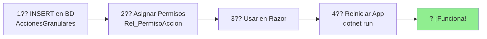

# ?? Quick Start: Usar Acciones Dinámicas en tu Módulo

> **Guía rápida de 5 minutos para usar `<AuthorizeAction>` en componentes de módulos**

---

## ? TL;DR (Too Long, Didn't Read)

```razor
<!-- En cualquier .razor de tu módulo -->
<AuthorizeAction Action="TuModulo.Componente.Accion">
    <button>Hacer algo</button>
</AuthorizeAction>
```

? **Eso es todo.** No requiere imports, configuración ni código adicional.

---

## ?? Paso a Paso

### 1?? Crear Acción en Base de Datos

```sql
-- Insertar nueva acción
INSERT INTO AccionesGranulares (IdModulo, IdComponente, CodigoAccion, NombreAccion, DescripcionAccion, Activo)
VALUES (
    1,                                    -- ID de tu módulo
    2,                                    -- ID del componente (opcional)
    'Finanzas.Facturas.Exportar',       -- Código de acción (formato: Modulo.Componente.Accion)
    'Exportar Facturas',                 -- Nombre descriptivo
    'Permite exportar facturas a Excel',  -- Descripción
    1                                     -- Activo
);

-- Asignar permisos (roles que pueden ejecutar esta acción)
DECLARE @IdAccion INT = SCOPE_IDENTITY();

INSERT INTO Rel_PermisoAccion (IdAccionGranular, IdPermiso) VALUES (@IdAccion, 1);  -- Admin
INSERT INTO Rel_PermisoAccion (IdAccionGranular, IdPermiso) VALUES (@IdAccion, 2);  -- Gerente
```

### 2?? Usar en tu Componente Razor

```razor
<!-- src/Modules/Finanzas/Components/Facturas.razor -->
@page "/finanzas/facturas"
@rendermode InteractiveServer

<h1>Gestión de Facturas</h1>

<!-- ? Usar AuthorizeAction directamente -->
<AuthorizeAction Action="Finanzas.Facturas.Exportar">
    <button class="btn btn-success" @onclick="ExportarExcel">
        <i class="ri-file-excel-line"></i> Exportar a Excel
    </button>
</AuthorizeAction>

@code {
    private void ExportarExcel()
    {
        // Tu lógica de exportación
    }
}
```

### 3?? Reiniciar Aplicación

```bash
cd src/Host/VRM_PluginDemo.Blazor.Server
dotnet run
```

? **¡Listo!** El botón aparecerá solo para usuarios con rol Admin o Gerente.

---

## ?? Casos de Uso Comunes

### Caso 1: Botón Simple

```razor
<AuthorizeAction Action="Modulo.Componente.Crear">
    <button @onclick="Crear">Nuevo</button>
</AuthorizeAction>
```

### Caso 2: Múltiples Botones con Diferentes Permisos

```razor
<!-- Ver: Todos -->
<AuthorizeAction Action="Finanzas.Facturas.Ver">
    <button @onclick="Ver">Ver Detalles</button>
</AuthorizeAction>

<!-- Editar: Admin y Gerente -->
<AuthorizeAction Action="Finanzas.Facturas.Editar">
    <button @onclick="Editar">Editar</button>
</AuthorizeAction>

<!-- Eliminar: Solo Admin -->
<AuthorizeAction Action="Finanzas.Facturas.Eliminar">
    <button @onclick="Eliminar">Eliminar</button>
</AuthorizeAction>
```

### Caso 3: Proteger Sección Completa

```razor
<AuthorizeAction Action="Finanzas.Reportes.Confidencial">
    <div class="card border-danger">
        <div class="card-header bg-danger text-white">
            <h5>?? Reportes Confidenciales</h5>
        </div>
        <div class="card-body">
            <p>Solo gerentes pueden ver esta sección</p>
            <button @onclick="GenerarReporte">Ver Reporte de Costos</button>
        </div>
    </div>
</AuthorizeAction>
```

### Caso 4: Acciones Condicionales

```razor
@if (factura.Estado == EstadoFactura.Borrador)
{
    <!-- Solo mostrar "Timbrar" si está en borrador Y usuario tiene permiso -->
    <AuthorizeAction Action="Finanzas.Facturas.TimbrarSAT">
        <button @onclick="() => Timbrar(factura)">
            <i class="ri-check-line"></i> Timbrar en SAT
        </button>
    </AuthorizeAction>
}
```

### Caso 5: Menú Contextual

```razor
<div class="dropdown">
    <button class="btn btn-secondary dropdown-toggle">
        Acciones
    </button>
    <div class="dropdown-menu">
        <AuthorizeAction Action="Finanzas.Facturas.Ver">
            <a class="dropdown-item" @onclick="Ver">Ver</a>
        </AuthorizeAction>
        
        <AuthorizeAction Action="Finanzas.Facturas.Editar">
            <a class="dropdown-item" @onclick="Editar">Editar</a>
        </AuthorizeAction>
        
        <AuthorizeAction Action="Finanzas.Facturas.Duplicar">
            <a class="dropdown-item" @onclick="Duplicar">Duplicar</a>
        </AuthorizeAction>
        
        <div class="dropdown-divider"></div>
        
        <AuthorizeAction Action="Finanzas.Facturas.Eliminar">
            <a class="dropdown-item text-danger" @onclick="Eliminar">
                <i class="ri-delete-bin-line"></i> Eliminar
            </a>
        </AuthorizeAction>
    </div>
</div>
```

---

## ?? Formato de Action Key

```
{ModuleName}.{ComponentName}.{ActionName}
     ?             ?              ?
  Finanzas    .Facturas      .Crear
```

### ? Formatos Válidos

```
Finanzas.Facturas.Crear
Finanzas.Facturas.Editar
Finanzas.Facturas.TimbrarSAT
Finanzas.Reportes.VerConfidencial
Prospectos.Lista.Aprobar
Prospectos.Lista.RechazarLegal
```

### ? Formatos Inválidos

```
FinanzasFacturasCrear           # Sin puntos
Facturas.Crear                  # Falta nombre del módulo
Finanzas.Facturas               # Falta nombre de la acción
finanzas.facturas.crear         # Usar PascalCase
```

---

## ?? Personalizar Renderizado

### Mostrar Mensaje Alternativo si No Hay Permiso

```razor
<AuthorizeAction Action="Finanzas.Facturas.Eliminar">
    <Authorized>
        <button class="btn btn-danger" @onclick="Eliminar">Eliminar</button>
    </Authorized>
    <NotAuthorized>
        <p class="text-muted">No tienes permisos para eliminar</p>
    </NotAuthorized>
</AuthorizeAction>
```

**Nota:** El componente actual **no soporta** `<Authorized>` / `<NotAuthorized>`. 
Si lo necesitas, puedes usar `AuthorizeView` tradicional:

```razor
<!-- Alternativa con AuthorizeView -->
<AuthorizeView Roles="Admin,GerenteFinanzas">
    <Authorized>
        <button @onclick="Eliminar">Eliminar</button>
    </Authorized>
    <NotAuthorized>
        <p class="text-muted">Sin permisos</p>
    </NotAuthorized>
</AuthorizeView>
```

---

## ?? Tabla de Referencia: IDs de Permisos

| ID | Nombre Permiso | Descripción |
|----|----------------|-------------|
| 1 | Admin | Acceso total al sistema |
| 2 | GerenteFinanzas | Gerente del módulo de finanzas |
| 3 | CoordinadorFinanzas | Coordinador de finanzas |
| 4 | Contador | Rol de contador |
| 5 | GestorProspectos | Gestor de prospectos |
| 6 | CoordinadorProspectos | Coordinador de prospectos |
| 7 | RevisorLegal | Revisor legal |
| 8 | RevisorFinanciero | Revisor financiero |
| 9 | RevisorTecnico | Revisor técnico |

**?? Tip:** Consulta la tabla `Permisos` en la BD para ver la lista completa actualizada.

---

## ?? Debugging

### Ver en Logs qué Acciones se Cargaron

```bash
# Al iniciar la app, buscar en logs:
[ModuleManager] 10 acciones inyectadas para Finanzas
```

### Verificar Permisos de una Acción en BD

```sql
SELECT 
    ag.CodigoAccion,
    p.NombrePermiso AS RolRequerido
FROM AccionesGranulares ag
INNER JOIN Rel_PermisoAccion rp ON ag.IdAccionGranular = rp.IdAccionGranular
INNER JOIN Permisos p ON rp.IdPermiso = p.IdPermiso
WHERE ag.CodigoAccion = 'Finanzas.Facturas.Crear';
```

**Resultado esperado:**
```
CodigoAccion              | RolRequerido
--------------------------|------------------
Finanzas.Facturas.Crear   | Admin
Finanzas.Facturas.Crear   | GerenteFinanzas
Finanzas.Facturas.Crear   | CoordinadorFinanzas
```

### Verificar Roles del Usuario

```razor
<!-- Agregar temporalmente en tu componente -->
<AuthorizeView>
    <Authorized>
        <p>Usuario: @context.User.Identity?.Name</p>
        <p>Roles: @string.Join(", ", context.User.Claims.Where(c => c.Type == ClaimTypes.Role).Select(c => c.Value))</p>
    </Authorized>
</AuthorizeView>
```

---

## ?? Errores Comunes

### ? Error: "El botón no aparece para nadie"

**Causas posibles:**
1. Action Key mal escrito
2. Acción no existe en BD
3. No hay permisos asignados en `Rel_PermisoAccion`

**Solución:**
```sql
-- Verificar acción existe
SELECT * FROM AccionesGranulares WHERE CodigoAccion = 'TuModulo.Componente.Accion';

-- Verificar tiene permisos
SELECT * FROM Rel_PermisoAccion WHERE IdAccionGranular = [ID_DE_TU_ACCION];
```

---

### ? Error: "El botón aparece para todos"

**Causa:** Probablemente estás usando `AuthorizeView` en lugar de `AuthorizeAction`.

**Incorrecto:**
```razor
<AuthorizeView>  <!-- ? Sin restricción de roles -->
    <Authorized>
        <button>Eliminar</button>
    </Authorized>
</AuthorizeView>
```

**Correcto:**
```razor
<AuthorizeAction Action="Finanzas.Facturas.Eliminar">
    <button>Eliminar</button>
</AuthorizeAction>
```

---

### ? Error: "Cambios en BD no se reflejan"

**Causa:** Caché de módulos (se cargan una vez al iniciar).

**Solución:** Reiniciar aplicación:
```bash
# Detener con Ctrl+C
# Volver a ejecutar
dotnet run
```

---

## ?? Recursos Adicionales

- **Documentación completa:** [SISTEMA_DE_ACCIONES_DINAMICAS.md](./SISTEMA_DE_ACCIONES_DINAMICAS.md)
- **Diagramas visuales:** [DIAGRAMAS_SISTEMA_ACCIONES.md](./DIAGRAMAS_SISTEMA_ACCIONES.md)
- **Código fuente de AuthorizeAction:** [src/Host/.../Auth/AuthorizeAction.razor](../src/Host/VRM_PluginDemo.Blazor.Server/Components/Auth/AuthorizeAction.razor)

---

## ?? Tips Pro

### 1. Usar Convención de Nombres Consistente

```
{Modulo}.{Componente}.{Verbo}

? Finanzas.Facturas.Ver
? Finanzas.Facturas.Crear
? Finanzas.Facturas.TimbrarSAT
? Prospectos.Lista.Aprobar
```

### 2. Agrupar Acciones por Nivel de Riesgo

```sql
-- Lectura (bajo riesgo) ? Muchos roles
INSERT INTO Rel_PermisoAccion VALUES (ActionId_Ver, 1);  -- Admin
INSERT INTO Rel_PermisoAccion VALUES (ActionId_Ver, 2);  -- Gerente
INSERT INTO Rel_PermisoAccion VALUES (ActionId_Ver, 3);  -- Coordinador
INSERT INTO Rel_PermisoAccion VALUES (ActionId_Ver, 4);  -- Operador

-- Escritura (riesgo medio) ? Algunos roles
INSERT INTO Rel_PermisoAccion VALUES (ActionId_Editar, 1);  -- Admin
INSERT INTO Rel_PermisoAccion VALUES (ActionId_Editar, 2);  -- Gerente
INSERT INTO Rel_PermisoAccion VALUES (ActionId_Editar, 3);  -- Coordinador

-- Crítica (alto riesgo) ? Pocos roles
INSERT INTO Rel_PermisoAccion VALUES (ActionId_Eliminar, 1);  -- Admin
INSERT INTO Rel_PermisoAccion VALUES (ActionId_Eliminar, 2);  -- Gerente
```

### 3. Documentar Acciones Especiales

```sql
-- Acción con lógica de negocio compleja
INSERT INTO AccionesGranulares (
    IdModulo, 
    CodigoAccion, 
    NombreAccion, 
    DescripcionAccion
)
VALUES (
    1,
    'Finanzas.Facturas.TimbrarSAT',
    'Timbrar Factura en SAT',
    '?? Acción irreversible. Envía la factura al SAT para timbrado fiscal. Requiere conexión con PAC y certificados vigentes.'
);
```

---

## ?? Resumen



**Pasos:**
1. ? Crear acción en BD
2. ? Asignar permisos
3. ? Usar `<AuthorizeAction>` en tu componente
4. ? Reiniciar app
5. ? **¡Ya funciona sin código adicional!**

---

**?? ¡Empieza a usarlo ahora!**

¿Preguntas? Consulta la [documentación completa](./SISTEMA_DE_ACCIONES_DINAMICAS.md) o revisa los [ejemplos en Facturas.razor](../src/Modules/Finanzas/VRM_PluginDemo.Modules.Finanzas/Components/Facturas.razor).
