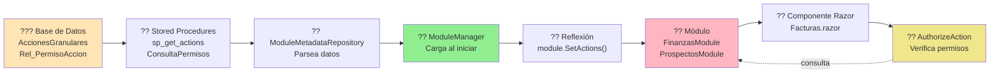
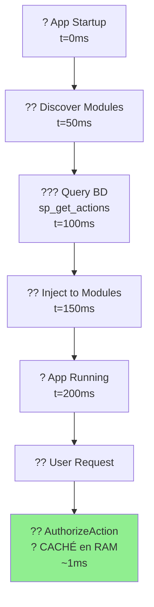

# ?? Sistema de Acciones Dinámicas

> **Autorización granular basada en base de datos - ZERO configuración en módulos**

---

## ?? Quick Example

```razor
<!-- ? Esto simplemente funciona -->
<AuthorizeAction Action="Finanzas.Facturas.Crear">
    <button>Nueva Factura</button>
</AuthorizeAction>
```

**¿Dónde están los permisos?** ? En la base de datos ???  
**¿Requiere configuración?** ? NO ?  
**¿Requiere imports?** ? NO ?  
**¿Requiere recompilar módulos?** ? NO ?

---

## ?? Flujo Visual



---

## ?? Documentación

| Documento | Tiempo | Para Quién |
|-----------|--------|------------|
| **[?? QUICKSTART_ACCIONES.md](./QUICKSTART_ACCIONES.md)** | 5 min | Desarrolladores que necesitan usar permisos **ahora** |
| **[?? SISTEMA_DE_ACCIONES_DINAMICAS.md](./SISTEMA_DE_ACCIONES_DINAMICAS.md)** | 30 min | Arquitectos/Devs que necesitan entender **cómo funciona** |
| **[?? DIAGRAMAS_SISTEMA_ACCIONES.md](./DIAGRAMAS_SISTEMA_ACCIONES.md)** | 15 min | Todos - **visualización completa** con 11 diagramas |

---

## ?? Casos de Uso

### Caso 1: Botón con Permiso Simple
```razor
<AuthorizeAction Action="Finanzas.Facturas.Editar">
    <button @onclick="Editar">Editar</button>
</AuthorizeAction>
```

### Caso 2: Acción Crítica (Solo Gerentes)
```razor
<AuthorizeAction Action="Finanzas.Facturas.TimbrarSAT">
    <button @onclick="TimbrarSAT">Timbrar en SAT</button>
</AuthorizeAction>
```

### Caso 3: Proteger Sección Completa
```razor
<AuthorizeAction Action="Finanzas.Reportes.Confidencial">
    <div class="card border-danger">
        <h5>?? Reportes Confidenciales</h5>
        <button @onclick="VerCostos">Ver Costos</button>
    </div>
</AuthorizeAction>
```

---

## ?? Cómo Funciona (3 Pilares)

### 1?? Inyección de Dependencias Global
```csharp
// Program.cs - Una vez al iniciar
builder.Services.AddSingleton<IModuleManager>(moduleManager);
```

```razor
// AuthorizeAction.razor - Inyecta automáticamente
@inject IEnumerable<IModule> Modules
```

### 2?? Imports Globales de Blazor
```razor
<!-- _Imports.razor del Host -->
@using VRM_Plugin.Blazor.Server.Components.Auth
```
? Todos los módulos lo heredan ? `AuthorizeAction` disponible en todos lados

### 3?? Carga Automática al Inicio
```csharp
// Program.cs
await moduleManager.DiscoverAndLoadModulesAsync("Modules/");
// ? Módulos YA tienen acciones inyectadas ANTES de que la app inicie
```

---

## ??? Estructura de Base de Datos

```sql
-- Tabla: AccionesGranulares
CREATE TABLE AccionesGranulares (
    IdAccionGranular INT PRIMARY KEY IDENTITY,
    IdModulo INT NOT NULL,
    IdComponente INT NULL,
    CodigoAccion NVARCHAR(200) NOT NULL,  -- "Finanzas.Facturas.Crear"
    NombreAccion NVARCHAR(100) NOT NULL,
    DescripcionAccion NVARCHAR(500),
    Activo BIT DEFAULT 1
);

-- Tabla: Rel_PermisoAccion (Relación muchos a muchos)
CREATE TABLE Rel_PermisoAccion (
    IdAccionGranular INT NOT NULL,
    IdPermiso INT NOT NULL,  -- ID del rol (1=Admin, 2=Gerente, etc.)
    PRIMARY KEY (IdAccionGranular, IdPermiso)
);
```

---

## ?? Agregar Nueva Acción (Sin Código)

### 1. INSERT en Base de Datos
```sql
INSERT INTO AccionesGranulares (IdModulo, CodigoAccion, NombreAccion, DescripcionAccion, Activo)
VALUES (1, 'Finanzas.Facturas.Duplicar', 'Duplicar Factura', 'Crea copia de factura', 1);

DECLARE @IdAccion INT = SCOPE_IDENTITY();
INSERT INTO Rel_PermisoAccion VALUES (@IdAccion, 1);  -- Admin
INSERT INTO Rel_PermisoAccion VALUES (@IdAccion, 2);  -- Gerente
```

### 2. Usar en Componente Razor
```razor
<AuthorizeAction Action="Finanzas.Facturas.Duplicar">
    <button @onclick="Duplicar">
        <i class="ri-file-copy-line"></i> Duplicar
    </button>
</AuthorizeAction>
```

### 3. Reiniciar Aplicación
```bash
dotnet run
```

? **¡Ya funciona!** Sin compilar módulos, sin cambiar código.

---

## ?? Comparación: Antes vs Después

| Aspecto | ? Antes (Hardcoded) | ? Después (Dinámico) |
|---------|---------------------|---------------------|
| **Cambiar permisos** | Recompilar módulo | UPDATE en BD |
| **Agregar acción** | Cambiar código C# | INSERT en BD |
| **Sincronización** | Manual | Automática |
| **Auditoría** | No | Sí (BD tiene log) |
| **Hot reload** | No | Sí (reiniciar app) |

---

## ?? Debugging

### Ver qué acciones se cargaron:
```bash
# En logs al iniciar:
[ModuleManager] 10 acciones inyectadas para Finanzas
```

### Verificar permisos de una acción:
```sql
SELECT 
    ag.CodigoAccion,
    p.NombrePermiso AS RolRequerido
FROM AccionesGranulares ag
INNER JOIN Rel_PermisoAccion rp ON ag.IdAccionGranular = rp.IdAccionGranular
INNER JOIN Permisos p ON rp.IdPermiso = p.IdPermiso
WHERE ag.CodigoAccion = 'Finanzas.Facturas.Crear';
```

---

## ?? Errores Comunes

### ? "El botón no aparece"

**Posibles causas:**
1. Action Key mal escrito
2. Usuario no tiene rol requerido
3. Módulo no está cargado

**Solución:**
1. Verificar en BD: `SELECT * FROM AccionesGranulares WHERE CodigoAccion = 'Tu.Accion'`
2. Verificar logs: `[ModuleManager] Módulo descubierto: Finanzas`
3. Verificar roles del usuario en Claims

---

## ?? Arquitectura Técnica

### Componentes Clave:

```
???????????????????????????????????????????????
?  ??? SQL Server                              ?
?  ?? AccionesGranulares                      ?
?  ?? Rel_PermisoAccion                       ?
?  ?? sp_get_actions                          ?
?  ?? ConsultaPermisos                        ?
???????????????????????????????????????????????
                    ?
???????????????????????????????????????????????
?  ?? ModuleMetadataRepository                ?
?  ?? GetActionsByModuleId()                  ?
?     ?? Parsea "1,2,3" ? List<int>           ?
???????????????????????????????????????????????
                    ?
???????????????????????????????????????????????
?  ?? ModuleManager                           ?
?  ?? LoadModuleMetadataFromDatabase()        ?
?     ?? Usa Reflexión:                       ?
?        module.SetActions(actions)           ?
???????????????????????????????????????????????
                    ?
???????????????????????????????????????????????
?  ?? FinanzasModule                          ?
?  ?? _actions (inyectadas)                   ?
?  ?? _actionPermissions (inyectadas)         ?
?  ?? GetActionPermission() ? Dictionary      ?
???????????????????????????????????????????????
                    ?
???????????????????????????????????????????????
?  ?? Facturas.razor                          ?
?  ?? <AuthorizeAction Action="...">          ?
???????????????????????????????????????????????
                    ?
???????????????????????????????????????????????
?  ?? AuthorizeAction.razor                   ?
?  ?? @inject IEnumerable<IModule>            ?
?  ?? Extrae moduleId de Action               ?
?  ?? Busca módulo en Modules                 ?
?  ?? module.GetActionPermission(roleId)      ?
?  ?? user.IsInRole(allowedRole) ? Render     ?
???????????????????????????????????????????????
```

---

## ?? Performance



? **Queries a BD:** Solo al iniciar  
? **Runtime:** Ultra rápido (datos en RAM)  
? **Sin overhead:** Consulta directa a Dictionary en memoria

---

## ?? Recursos

- **[?? Documentación Completa](./SISTEMA_DE_ACCIONES_DINAMICAS.md)** - Todo el detalle técnico
- **[?? Quick Start](./QUICKSTART_ACCIONES.md)** - Empieza en 5 minutos
- **[?? Diagramas](./DIAGRAMAS_SISTEMA_ACCIONES.md)** - 11 diagramas visuales
- **[?? Índice](./INDICE_DOCUMENTACION.md)** - Encuentra cualquier doc

---

## ?? Resumen

```razor
<!-- ? Un solo componente para toda la app -->
<AuthorizeAction Action="Modulo.Componente.Accion">
    <button>Hacer algo</button>
</AuthorizeAction>
```

**Ventajas:**
- ? Permisos en base de datos
- ? Sin configuración en módulos
- ? Sin imports adicionales
- ? Sin recompilar para cambios
- ? Auditable y centralizado
- ? Escalable a N módulos

**Resultado:** ?? **ZERO configuración, máxima flexibilidad**

---

**?? Creado:** Enero 2025  
**?? Versión:** 1.0  
**?? Mantiene:** Equipo VRM Plugin System
