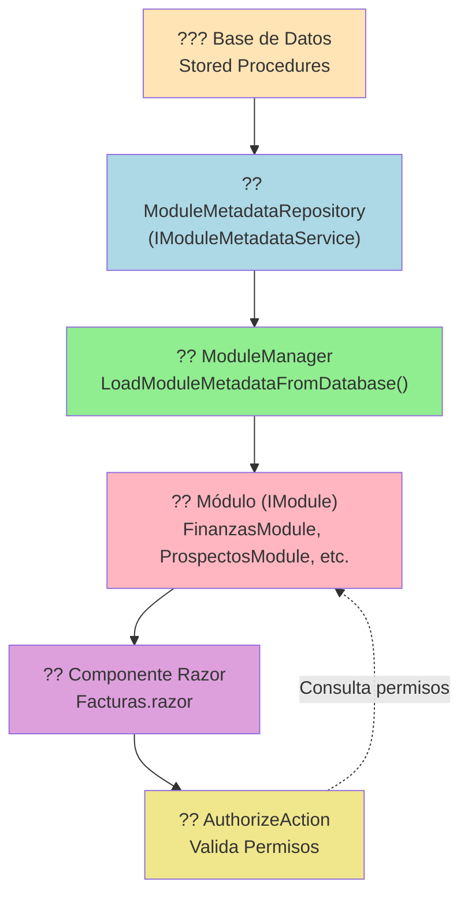

# ?? Sistema de Acciones Dinámicas - Guía Completa

> **Documentación técnica del sistema de autorización basado en acciones granulares cargadas desde base de datos**

---

## ?? Tabla de Contenidos

1. [Introducción](#-introducción)
2. [Arquitectura del Sistema](#-arquitectura-del-sistema)
3. [Flujo de Carga de Acciones](#-flujo-de-carga-de-acciones)
4. [Uso en Componentes](#-uso-en-componentes)
5. [Por Qué No Requiere Configuración Adicional](#-por-qué-no-requiere-configuración-adicional)
6. [Ejemplos Prácticos](#-ejemplos-prácticos)
7. [Troubleshooting](#-troubleshooting)

---

## ?? Introducción

Este sistema permite:

- ? **Cargar permisos de acciones desde base de datos** en tiempo de ejecución
- ? **Inyectar automáticamente** las acciones a los módulos al arrancar la aplicación
- ? **Usar componente `<AuthorizeAction>`** en cualquier parte sin configuración adicional
- ? **Mantener la seguridad sincronizada** entre BD y aplicación sin recompilar

---

## ??? Arquitectura del Sistema

### Componentes Principales



---

## ?? Flujo de Carga de Acciones

### Paso 1: Arranque de la Aplicación (`Program.cs`)

```csharp
// ? Registrar servicios de datos
builder.Services.AddScoped<IModuleMetadataService, ModuleMetadataRepository>();

// ? Crear ModuleManager con servicio de metadata
using (var scope = builder.Services.BuildServiceProvider().CreateScope())
{
    var logger = scope.ServiceProvider.GetRequiredService<ILogger<ModuleManager>>();
    var metadataService = scope.ServiceProvider.GetRequiredService<IModuleMetadataService>();
    
    moduleManager = new ModuleManager(logger, metadataService);
    builder.Services.AddSingleton<IModuleManager>(moduleManager);
    
    // ? Cargar módulos con metadata desde BD
    var modulosEncontrados = await moduleManager.DiscoverAndLoadModulesAsync(modulesPath);
}
```

**¿Qué pasa aquí?**
- Se registra `ModuleMetadataRepository` como implementación de `IModuleMetadataService`
- Se crea `ModuleManager` **con** el servicio de metadata
- Se llama a `DiscoverAndLoadModulesAsync()` que activa la carga desde BD

---

### Paso 2: Descubrimiento y Carga en `ModuleManager`

#### **2.1. Buscar DLLs de Módulos**

```csharp
// ModuleManager.cs - DiscoverAndLoadModulesAsync()
var dllFiles = Directory.GetFiles(modulesPath, "VRM_Plugin.*.dll", SearchOption.AllDirectories)
    .Where(f => !f.Contains("VRM_Plugin.Core") && !f.Contains("VRM_Plugin.Blazor"))
    .ToArray();

foreach (var dllPath in dllFiles)
{
    var assembly = Assembly.LoadFrom(dllPath);
    var moduleTypes = assembly.GetTypes()
        .Where(t => typeof(IModule).IsAssignableFrom(t) && !t.IsInterface && !t.IsAbstract)
        .ToList();
    
    foreach (var moduleType in moduleTypes)
    {
        var module = (IModule)Activator.CreateInstance(moduleType)!;
        
        // ? CLAVE: Inyectar metadata desde BD
        await LoadModuleMetadataFromDatabase(module);
        
        _loadedModules.Add(module);
    }
}
```

#### **2.2. Inyectar Metadata desde BD**

```csharp
private async Task LoadModuleMetadataFromDatabase(IModule module)
{
    // 1?? Obtener metadata básica (nombre, versión, descripción)
    var metadata = _metadataService.GetModuleMetadata(module.ModuleId);
    
    // 2?? Obtener componentes desde SP: sp_get_component
    var components = _metadataService.GetComponentsByModuleId(module.ModuleId);
    
    // 3?? ? Obtener ACCIONES desde SP: sp_get_actions
    var actions = _metadataService.GetActionsByModuleId(module.ModuleId);
    
    // 4?? ? Obtener PERMISOS por acción desde SP: ConsultaPermisos
    var permissions = _metadataService.GetActionPermissions(module.ModuleName);
    
    // 5?? Inyectar todo al módulo usando REFLEXIÓN
    var moduleType = module.GetType();
    
    // Inyectar acciones
    var setActionsMethod = moduleType.GetMethod("SetActions");
    if (setActionsMethod != null)
    {
        setActionsMethod.Invoke(module, new object[] { actions });
        _logger.LogDebug("{Count} acciones inyectadas para {ModuleName}", 
            actions.Count, module.ModuleName);
    }
    
    // Inyectar permisos
    var setPermissionsMethod = moduleType.GetMethod("SetActionPermissions");
    if (setPermissionsMethod != null)
    {
        setPermissionsMethod.Invoke(module, new object[] { permissions });
        _logger.LogDebug("{Count} permisos inyectados para {ModuleName}", 
            permissions.Count, module.ModuleName);
    }
}
```

**?? ¿Qué hace cada llamada?**

| Método | Stored Procedure | Retorna |
|--------|-----------------|---------|
| `GetModuleMetadata(moduleId)` | `sp_get_module_info` | `ModuleDto` (nombre, versión) |
| `GetComponentsByModuleId(moduleId)` | `sp_get_component` | `List<ModuleComponentDto>` (menú, rutas) |
| `GetActionsByModuleId(moduleId)` | `sp_get_actions` | `List<ModuleActionDto>` (acciones con IDs de permisos) |
| `GetActionPermissions(moduleName)` | `ConsultaPermisos` | `Dictionary<string, string[]>` (ActionKey ? Roles) |

---

### Paso 3: Stored Procedure `sp_get_actions`

```sql
CREATE PROCEDURE sp_get_actions
    @module_id INT
AS
BEGIN
    SELECT 
        ag.IdAccionGranular AS ActionKeyId,
        ag.IdComponente AS ComponentId,
        ag.CodigoAccion AS ActionKey,
        ag.NombreAccion AS Name,
        ag.DescripcionAccion AS Description,
        
        -- ? CLAVE: Concatenar IDs de permisos como string "1,2,3"
        STRING_AGG(CAST(rp.IdPermiso AS VARCHAR), ',') AS Roles,
        
        ag.Activo AS IsActive
        
    FROM AccionesGranulares ag
    LEFT JOIN Rel_PermisoAccion rp ON ag.IdAccionGranular = rp.IdAccionGranular
    WHERE ag.IdModulo = @module_id
    GROUP BY 
        ag.IdAccionGranular, 
        ag.IdComponente,
        ag.CodigoAccion,
        ag.NombreAccion,
        ag.DescripcionAccion,
        ag.Activo
    ORDER BY ag.NombreAccion;
END
```

**Ejemplo de resultado:**

| ActionKeyId | ActionKey | Name | Roles |
|-------------|-----------|------|-------|
| 2 | Finanzas.Facturas.Crear | Crear Factura | 1,2,3 |
| 5 | Finanzas.Facturas.TimbrarSAT | Timbrar en SAT | 1,2 |

---

### Paso 4: Parseo en `ModuleMetadataRepository`

```csharp
public List<ModuleActionDto> GetActionsByModuleId(int moduleId)
{
    // ? Ejecutar SP y mapear automáticamente a DTOs
    var actions = _db.ExecuteStoredProcedure<ModuleActionDto>("sp_get_actions", 
        new Dictionary<string, object>
        {
            { "module_id", moduleId }
        });
    
    // ? Post-procesamiento: Convertir "1,2,3" ? List<int> { 1, 2, 3 }
    foreach (var action in actions)
    {
        action.RequiredPermissionIds = ParseRolesString(action.RolesString);
    }
    
    return actions;
}

private List<int> ParseRolesString(string? rolesString)
{
    if (string.IsNullOrWhiteSpace(rolesString))
        return new List<int>();
    
    return rolesString
        .Split(',', StringSplitOptions.RemoveEmptyEntries)
        .Select(int.Parse)
        .ToList();
}
```

**Antes:**
```csharp
RolesString = "1,2,3"
RequiredPermissionIds = []  // vacío
```

**Después:**
```csharp
RolesString = "1,2,3"
RequiredPermissionIds = [1, 2, 3]  // parseado
```

---

### Paso 5: Inyección al Módulo (`FinanzasModule`)

```csharp
public class FinanzasModule : IModule
{
    private List<ModuleActionDto> _actions = new();
    private Dictionary<string, string[]> _actionPermissions = new();
    
    // ? Método llamado por ModuleManager
    public void SetActions(List<ModuleActionDto> actions)
    {
        _actions = actions ?? new List<ModuleActionDto>();
    }
    
    public void SetActionPermissions(Dictionary<string, string[]> permissions)
    {
        _actionPermissions = permissions ?? new Dictionary<string, string[]>();
    }
    
    // ? Usado por AuthorizeAction
    public Dictionary<string, string[]> GetActionPermission(string roleId)
    {
        return GetActionPermissions();
    }
    
    public Dictionary<string, string[]> GetActionPermissions()
    {
        if (_actionPermissions.Count > 0)
        {
            return _actionPermissions;  // ? Datos desde BD
        }
        
        // Fallback: valores por defecto (solo si BD falla)
        return new Dictionary<string, string[]>
        {
            ["Finanzas.Facturas.Crear"] = new[] { "Admin", "GerenteFinanzas" }
        };
    }
}
```

---

## ?? Uso en Componentes

### En `Facturas.razor`

```razor
<!-- ? USO DIRECTO: No requiere configuración adicional -->
<AuthorizeAction Action="Finanzas.Facturas.Nueva">
    <button class="btn btn-primary" @onclick="AbrirModalCrear">
        <i class="ri-add-line mr-1"></i>
        Nueva Factura
    </button>
</AuthorizeAction>
```

### ¿Cómo Funciona `AuthorizeAction`?

```razor
@namespace VRM_Plugin.Blazor.Server.Components.Auth
@inject IEnumerable<IModule> Modules

@if (HasPermission)
{
    @ChildContent
}

@code {
    [Parameter]
    public string Action { get; set; } = "";  // "Finanzas.Facturas.Nueva"
    
    [Parameter]
    public RenderFragment? ChildContent { get; set; }
    
    [CascadingParameter]
    private Task<AuthenticationState>? AuthenticationState { get; set; }
    
    private bool HasPermission = false;
    
    protected override async Task OnInitializedAsync()
    {
        var authState = await AuthenticationState;
        var user = authState.User;
        
        if (user.Identity?.IsAuthenticated ?? false)
        {
            // 1?? Extraer nombre del módulo de la acción
            var moduleId = Action.Split('.').FirstOrDefault();  // "Finanzas"
            
            // 2?? Buscar módulo inyectado
            var module = Modules.FirstOrDefault(m => m.ModuleName == moduleId);
            
            if (module != null)
            {
                // 3?? Obtener rol del usuario
                string roleId = user.Claims
                    .Where(c => c.Type == ClaimTypes.Role)
                    .Select(c => c.Value)
                    .FirstOrDefault();
                
                // 4?? ? Obtener permisos desde el módulo (ya cargados desde BD)
                var permissions = module.GetActionPermission(roleId);
                
                // 5?? Verificar si el usuario tiene permiso
                if (permissions.TryGetValue(Action, out var allowedRoles))
                {
                    HasPermission = allowedRoles.Any(role => user.IsInRole(role));
                }
            }
        }
    }
}
```

---

## ? Por Qué No Requiere Configuración Adicional

### 1. **Inyección de Dependencias Global**

```csharp
// Program.cs
builder.Services.AddSingleton<IModuleManager>(moduleManager);
```

- `IModuleManager` está registrado como **Singleton**
- Contiene **todos los módulos cargados**
- `AuthorizeAction` lo inyecta automáticamente:

```razor
@inject IEnumerable<IModule> Modules
```

### 2. **`_Imports.razor` del Host**

```razor
<!-- src\Host\VRM_PluginDemo.Blazor.Server\Components\_Imports.razor -->
@using VRM_Plugin.Blazor.Server.Components.Auth
```

- Todos los componentes (incluidos los de módulos) **heredan** este import
- `AuthorizeAction` está disponible **globalmente** sin necesidad de `@using` adicionales

### 3. **`AdditionalAssemblies` en Router**

```razor
<!-- Routes.razor -->
<Router AppAssembly="@typeof(Program).Assembly" 
        AdditionalAssemblies="@additionalAssemblies">
```

- Blazor conoce **todos los ensamblados de módulos**
- Puede resolver componentes como `AuthorizeAction` desde cualquier módulo

### 4. **Módulos Precargados al Inicio**

```csharp
// Program.cs
var modulosEncontrados = await moduleManager.DiscoverAndLoadModulesAsync(modulesPath);

// Ya tienen todas sus acciones inyectadas ANTES de que la app inicie
foreach (var modulo in modulos)
{
    modulo.ConfigureServices(builder.Services, builder.Configuration);
}
```

---

## ?? Ejemplos Prácticos

### Ejemplo 1: Botón Crear Factura

**Base de Datos:**
```sql
-- Acción en AccionesGranulares
IdAccionGranular: 2
CodigoAccion: 'Finanzas.Facturas.Crear'
NombreAccion: 'Crear Factura'

-- Permisos en Rel_PermisoAccion
IdAccionGranular: 2, IdPermiso: 1  -- Admin
IdAccionGranular: 2, IdPermiso: 2  -- GerenteFinanzas
IdAccionGranular: 2, IdPermiso: 3  -- CoordinadorFinanzas
```

**Componente Razor:**
```razor
<AuthorizeAction Action="Finanzas.Facturas.Crear">
    <button @onclick="CrearFactura">Nueva Factura</button>
</AuthorizeAction>
```

**Resultado:**
- ? Admin ? Ve el botón
- ? GerenteFinanzas ? Ve el botón
- ? CoordinadorFinanzas ? Ve el botón
- ? Contador ? NO ve el botón

---

### Ejemplo 2: Botón Timbrar SAT (Acción Crítica)

**Base de Datos:**
```sql
-- Acción en AccionesGranulares
IdAccionGranular: 5
CodigoAccion: 'Finanzas.Facturas.TimbrarSAT'
NombreAccion: 'Timbrar en SAT'

-- Permisos en Rel_PermisoAccion (solo gerentes)
IdAccionGranular: 5, IdPermiso: 1  -- Admin
IdAccionGranular: 5, IdPermiso: 2  -- GerenteFinanzas
```

**Componente Razor:**
```razor
@if (factura.Estado == EstadoFactura.Pendiente)
{
    <AuthorizeAction Action="Finanzas.Facturas.TimbrarSAT">
        <button @onclick="() => TimbrarFactura(factura)">
            <i class="ri-check-double-line"></i> Timbrar SAT
        </button>
    </AuthorizeAction>
}
```

**Resultado:**
- ? Admin ? Ve el botón
- ? GerenteFinanzas ? Ve el botón
- ? CoordinadorFinanzas ? NO ve el botón (operación crítica)
- ? Contador ? NO ve el botón

---

### Ejemplo 3: Agregar Nueva Acción (Sin Código)

#### **Paso 1: Insertar en BD**
```sql
-- 1. Crear acción
INSERT INTO AccionesGranulares (IdModulo, IdComponente, CodigoAccion, NombreAccion, DescripcionAccion, Activo)
VALUES (1, 2, 'Finanzas.Facturas.Duplicar', 'Duplicar Factura', 'Crea una copia de la factura seleccionada', 1);

-- 2. Asignar permisos
DECLARE @IdAccion INT = SCOPE_IDENTITY();
INSERT INTO Rel_PermisoAccion (IdAccionGranular, IdPermiso) VALUES (@IdAccion, 1);  -- Admin
INSERT INTO Rel_PermisoAccion (IdAccionGranular, IdPermiso) VALUES (@IdAccion, 2);  -- Gerente
```

#### **Paso 2: Usar en Componente**
```razor
<AuthorizeAction Action="Finanzas.Facturas.Duplicar">
    <button @onclick="() => DuplicarFactura(factura)">
        <i class="ri-file-copy-line"></i> Duplicar
    </button>
</AuthorizeAction>
```

#### **Paso 3: Reiniciar App**
```bash
dotnet run
```

? **Ya funciona** ? Sin compilar módulos, sin cambiar código

---

## ?? Troubleshooting

### ? Problema: `AuthorizeAction` No Encuentra el Módulo

**Síntoma:**
```
HasPermission = false (siempre)
```

**Causa:**
- El módulo no está cargado
- El nombre del módulo no coincide con el prefijo de la acción

**Solución:**
```csharp
// Verificar logs al iniciar
[ModuleManager] Módulo descubierto: Finanzas (ID: 1, Versión: 1.0.0)
```

Si no aparece, verificar:
1. ¿La DLL está en `Modules/`?
2. ¿El `ModuleName` en `FinanzasModule` es correcto?

---

### ? Problema: Usuario Tiene Permiso Pero No Ve el Botón

**Causa:**
- Roles no coinciden entre Claims y BD

**Diagnóstico:**
```csharp
// Agregar logging en AuthorizeAction
_logger.LogDebug("Usuario {User} tiene roles: {Roles}", 
    user.Identity.Name, 
    string.Join(", ", user.Claims.Where(c => c.Type == ClaimTypes.Role).Select(c => c.Value)));

_logger.LogDebug("Acción {Action} requiere roles: {Required}", 
    Action, 
    string.Join(", ", allowedRoles));
```

---

### ? Problema: Cambios en BD No Se Reflejan

**Causa:**
- Caché de módulos (se cargan una vez al iniciar)

**Solución:**
```bash
# Reiniciar aplicación
dotnet run
```

?? **Mejora futura:** Implementar recarga dinámica de permisos:
```csharp
public interface IModuleManager
{
    Task ReloadModulePermissionsAsync(string moduleName);
}
```

---

## ?? Comparación: Antes vs Después

### ? Antes (Permisos Hardcodeados)

```csharp
// FinanzasModule.cs
public Dictionary<string, string[]> GetActionPermissions()
{
    return new Dictionary<string, string[]>
    {
        ["Finanzas.Facturas.Crear"] = new[] { "Admin", "GerenteFinanzas" },
        ["Finanzas.Facturas.Editar"] = new[] { "Admin", "GerenteFinanzas" },
        // ... 20 líneas más
    };
}
```

**Problemas:**
- ? Cambios requieren recompilar
- ? No sincronizado con BD
- ? Difícil de mantener

---

### ? Después (Permisos Dinámicos)

```csharp
// FinanzasModule.cs
private Dictionary<string, string[]> _actionPermissions = new();

public void SetActionPermissions(Dictionary<string, string[]> permissions)
{
    _actionPermissions = permissions;  // ? Inyectado desde BD
}

public Dictionary<string, string[]> GetActionPermissions()
{
    return _actionPermissions;  // ? Siempre actualizado
}
```

**Ventajas:**
- ? Cambios en BD sin recompilar
- ? Sincronización automática
- ? Un solo punto de verdad (BD)
- ? Auditable (cambios en BD tienen registro)

---

## ?? Conclusión

El sistema funciona por **3 pilares fundamentales**:

1. **Carga Automática al Inicio**
   - `ModuleManager` carga módulos desde DLLs
   - Inyecta acciones y permisos desde BD usando reflexión

2. **Inyección de Dependencias Global**
   - `IModuleManager` disponible como Singleton
   - `AuthorizeAction` lo inyecta automáticamente

3. **Imports Globales de Blazor**
   - `_Imports.razor` del Host expone `AuthorizeAction`
   - Todos los módulos lo heredan sin configuración

**Resultado:** ? **ZERO configuración adicional en módulos**

```razor
<!-- ? Esto simplemente funciona -->
<AuthorizeAction Action="Finanzas.Facturas.Crear">
    <button>Crear</button>
</AuthorizeAction>
```

---

## ?? Referencias Adicionales

- [IModule Interface](../../src/Core/VRM_Plugin.Core.Abstractions/IModule.cs)
- [ModuleManager](../../src/Host/VRM_PluginDemo.Blazor.Server/Services/ModuleManager.cs)
- [AuthorizeAction Component](../../src/Host/VRM_PluginDemo.Blazor.Server/Components/Auth/AuthorizeAction.razor)
- [ModuleMetadataRepository](../../src/Core/VRM_Plugin.Core.Abstractions/Data/Repositories/ModuleMetadataRepository.cs)

---

**?? Mantenido por:** Equipo VRM Plugin System  
**?? Última actualización:** Enero 2025
